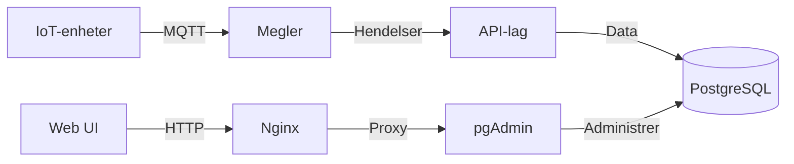

# 🎮 Klasseserver

[](https://www.docker.com/)
[](https://www.postgresql.org/)
[](https://nginx.org/)
[](https://mosquitto.org/)

En robust klasseromsserver-implementasjon som bruker bransjestandard containertjenester, med spillsporing og ELO-rangering.

## 🏗️ Systemarkitektur

### 🔧 Hovedkomponenter

#### 1. PostgreSQL Database 🗄️
- Permanent datalagring med automatisk sikkerhetskopiering
- Spillskjema med ELO-rangeringssystem
- Sikker tilgangskonfigurasjon
- Spillhistorikksporing

#### 2. pgAdmin Webgrensesnitt 🌐
- Webbasert databaseadministrasjon
- Sikker autentisering
- Containerbasert distribusjon

#### 3. API-lag 🔌
- RESTful API for spilldata
- MQTT-megler for IoT-integrasjon
- Sikre endepunkter med autentisering

### 💻 Teknisk Stack

Komponent | Teknologi | Formål
----------|-----------|--------
Containerisering | Docker & Docker Compose | Tjenesteorkestrering
Database | PostgreSQL 14+ | Primær datalagring
Database UI | pgAdmin 4 | Webbasert administrasjonsgrensesnitt
IoT-kommunikasjon | MQTT Mosquitto | Sanntids enhetsdata
Webserver | Nginx | Omvendt proxy & statiske filer
Sikkerhet | Let's Encrypt | SSL/TLS-kryptering

### 🔒 Sikkerhetsfunksjoner

- 🔐 Isolert containernettwerk
- 🛡️ SSL/TLS-kryptering
- 👥 Rollebasert tilgangskontroll
- 🔑 Sikker API-autentisering

### 📊 Spillfunksjoner

- 🎲 Støtte for flere spilltyper
  - ♟️ Sjakk med ELO-rangering
  - ⚽ Foosball med poengsystem
- 📈 Sanntids rangeringslister
- 🏆 Spillhistorikksporing
- 🎯 ELO-rangeringssystem

## 🚀 Hurtigstart

```bash
# Klon repository
git clone https://[repository-url]/klasseserver.git
cd klasseserver

# Konfigurer miljøvariabler
cp .env.example .env
nano .env

# Start tjenester
docker-compose up -d

# Verifiser installasjon
curl http://localhost/php/leaderboard.php
```

## 📋 Systemkrav

Komponent | Minimumskrav
----------|-------------
OS | Ubuntu 20.04 LTS
RAM | 4GB
Lagring | 20GB
CPU | 2 kjerner

## 🔄 Dataflyt



## 📚 Dokumentasjon

- [Installasjonsveiledning](INSTALL.md)
- [API-dokumentasjon](docs/API.md)
- [Spillregler](docs/GAMES.md)
- [Sikkerhetsveiledning](docs/SECURITY.md)

## 🛠️ Utvikling

```bash
# Kjør tester
docker-compose exec postgres psql -U admin -d klasseserver_db -f /docker-entrypoint-initdb.d/07-test-games.sql

# Sjekk logger
docker-compose logs -f

# Bygg tjenester på nytt
docker-compose up -d --build
```

## 🔍 Overvåking

- Databasestatus: `http://localhost/pgadmin`
- Serverinfo: `http://localhost/server-info.html`
- Rangeringslister: `http://localhost`

## 🤝 Bidra til Prosjektet

1. Fork repositoriet
2. Opprett din feature branch
3. Commit dine endringer
4. Push til branchen
5. Opprett en Pull Request

## 📄 Lisens

Dette prosjektet er lisensiert under MIT-lisensen - se [LICENSE](LICENSE)-filen for detaljer.

## 🙏 Anerkjennelser

- PostgreSQL-fellesskapet
- Docker-teamet
- MQTT Mosquitto-prosjektet
- Alle bidragsytere

---
Laget med ❤️ for klasseroms-gaming og læring
